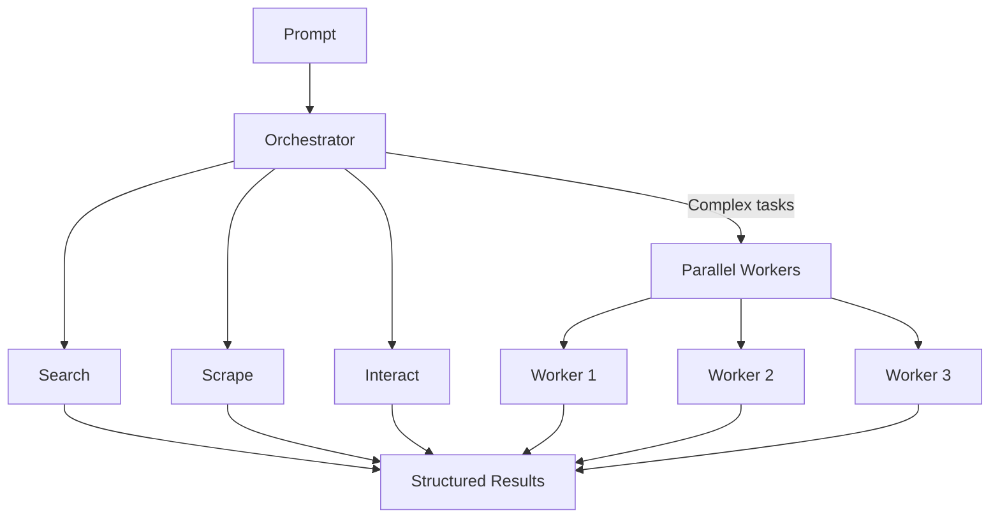

# Firecrawl Agent

AI-powered web research agent. Give it a prompt — it searches, scrapes, and extracts structured data from any website.

Built on [Firecrawl](https://firecrawl.dev/) and [firecrawl-aisdk](https://www.npmjs.com/package/firecrawl-aisdk).

## Get started

```bash
cd cli && npm install && npm run build && npm link
```

```bash
firecrawl-agent init my-agent
```

```
? Template
❯ Next.js (Full UI)      Complete web app with chat UI, history, settings
  Express (API only)     Lightweight Node.js API server with /v1/run endpoint
  Hono (Serverless)      Fast, lightweight API — ideal for edge and serverless
```

Pick a template, and you're running. The CLI auto-detects your Firecrawl API key and installs everything.

Or skip the prompts entirely:

```bash
firecrawl-agent init my-agent -t next                          # Full UI
firecrawl-agent init my-agent -t express --key anthropic=sk-...  # API server with keys
firecrawl-agent init my-agent --from user/repo                 # From any repo with agent-manifest.json
```

## How it works



## Use as an API or a library

**API** — deploy any template, call `POST /v1/run` from any language.

```bash
curl -X POST http://localhost:3000/api/v1/run \
  -H "Content-Type: application/json" \
  -d '{"prompt": "Compare pricing for Vercel vs Netlify", "format": "json"}'
```

**Library** — import directly, no server needed.

```typescript
import { createAgent } from '@firecrawl/agent-core'

const agent = createAgent({
  firecrawlApiKey: process.env.FIRECRAWL_API_KEY!,
  model: { provider: 'google', model: 'gemini-3-flash-preview' },
})

const result = await agent.run({ prompt: 'Compare pricing for Vercel vs Netlify' })
```

## Project structure

| Directory | What's inside |
|-----------|--------------|
| [`cli/`](./cli/) | CLI tool — `init`, `dev`, `deploy` |
| [`agent-core/`](./agent-core/) | Core agent logic, tools, skills, OpenAPI spec |
| [`templates/`](./templates/) | Next.js, Express, Hono server templates |
| [`sdks/`](./sdks/) | Auto-generated clients for 17 languages |
| [`deploy/`](./deploy/) | Vercel, Railway, Docker configs |

## License

MIT
