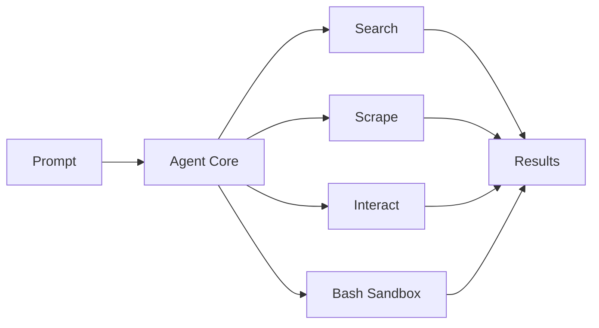
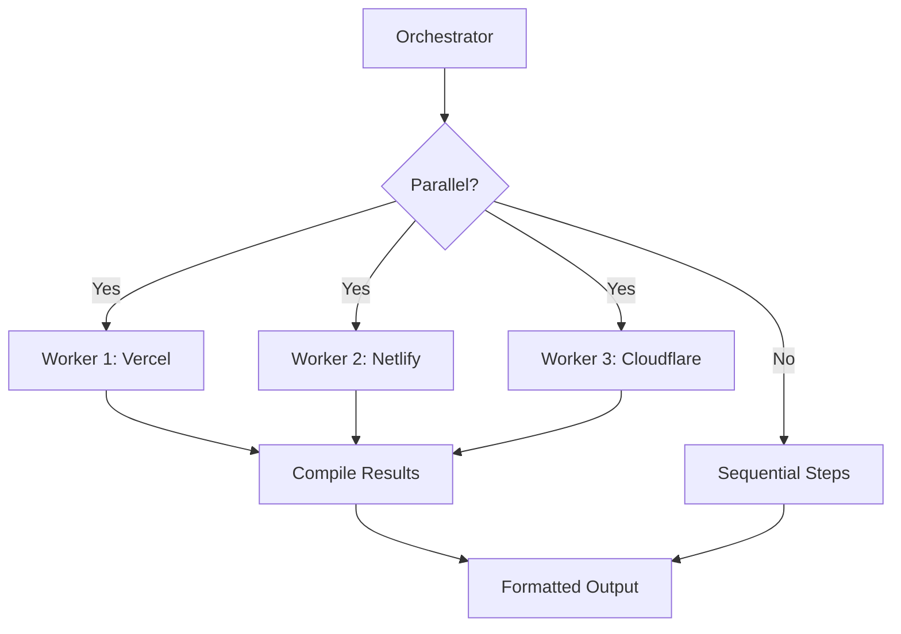
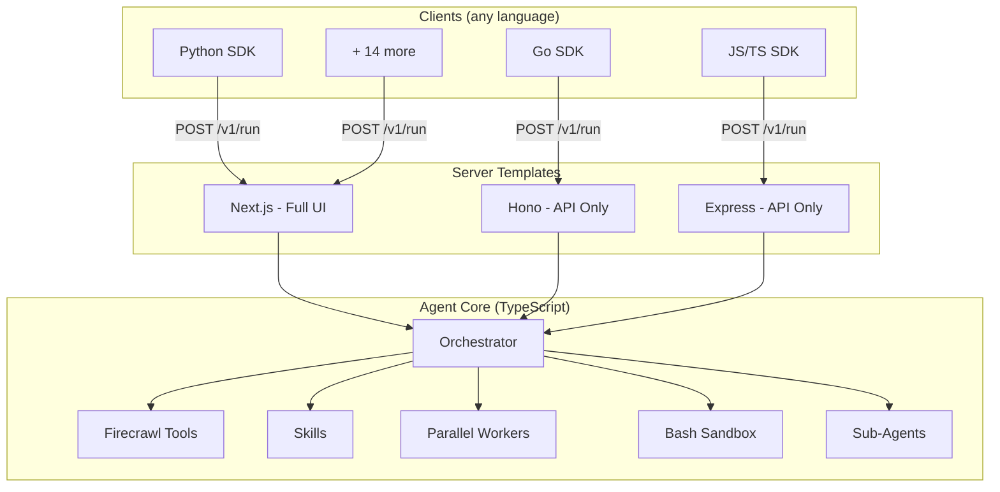

# Firecrawl Agent

AI-powered web research agent. Search, scrape, and extract structured data from any website.

Built on the [Vercel AI SDK](https://sdk.vercel.ai/) and [Firecrawl](https://firecrawl.dev/).

## Get started

Build the CLI, then scaffold a project in seconds:

```bash
cd cli && npm install && npm run build && npm link
```

```bash
firecrawl-agent init my-agent
```

```
  firecrawl-agent
  AI-powered web research agent

? Template
❯ Next.js (Full UI)      Complete web app with chat UI, history, settings
  Express (API only)     Lightweight Node.js API server with /v1/run endpoint
  Hono (Serverless)      Fast, lightweight API — ideal for edge and serverless
```

That's it. The CLI detects your Firecrawl API key, scaffolds the project, installs dependencies, and you're running.

### One-liners

```bash
firecrawl-agent init my-agent -t next       # Full UI with chat, history, settings
firecrawl-agent init my-agent -t express    # Lightweight API server
firecrawl-agent init my-agent -t hono       # Serverless-ready API
```

### With API keys

```bash
firecrawl-agent init my-agent -t express \
  --api-key fc-your-key \
  --key anthropic=sk-ant-... \
  --key openai=sk-...
```

Zero prompts. Scaffolds, installs, done.

### From an external repo

Any repo with an `agent-manifest.json` works as a template source:

```bash
firecrawl-agent init my-agent --from user/repo
firecrawl-agent init my-agent --from ./local-templates
```

## What it does

You give it a prompt. It searches the web, scrapes pages, extracts data, and returns structured results.

```
"Compare pricing for Vercel, Netlify, and Cloudflare Pages"

  -> Searches for each provider's pricing page
  -> Scrapes all three in parallel
  -> Extracts plan tiers, prices, features
  -> Returns a comparison table with sources
```

## How it works



The agent receives a prompt, plans its approach, then uses Firecrawl tools to gather data from the web. For complex tasks it spawns parallel workers that run independently and report back.



## Templates

| Template | What you get | Best for |
|----------|-------------|----------|
| **Next.js** | Full web app with chat UI, conversation history, settings panel, streaming visualization | Teams, demos, full experience |
| **Express** | Lightweight API server with `POST /v1/run` endpoint | Backend services, self-hosted |
| **Hono** | Fast serverless API with SSE streaming | Edge deployments, serverless |

All templates share the same agent core and expose the same API. Pick the one that fits your stack.

## Architecture



## Repository structure

```
cli/               CLI tool — scaffold, dev, deploy
agent-core/        Core agent logic, OpenAPI spec
templates/         Server templates (Next.js, Hono, Express)
sdks/              Auto-generated clients for 17 languages
examples/          Working examples for every language
deploy/            Platform configs (Vercel, Railway, Docker)
scripts/           SDK generation and testing tools
```

| Directory | README | What you'll find |
|-----------|--------|-----------------|
| [cli/](./cli/) | | `firecrawl-agent init`, `dev`, `deploy` commands |
| [agent-core/](./agent-core/) | [README](./agent-core/README.md) | `createAgent()` API, architecture, configuration |
| [templates/](./templates/) | [README](./templates/README.md) | Next.js (full UI), Hono (API-only), Express |
| [sdks/](./sdks/) | [README](./sdks/README.md) | Python, Go, JS, Ruby, Java, Rust, and 11 more |
| [examples/](./examples/) | [README](./examples/README.md) | 17 working examples with run commands |
| [deploy/](./deploy/) | [README](./deploy/README.md) | Vercel, Railway, Docker, Cloudflare |

## Two ways to use the agent

**As an API (any language)** -- deploy the server, call `POST /v1/run` from anywhere.

```python
# Python
import requests
result = requests.post("https://your-agent.example.com/api/v1/run", json={
    "prompt": "Get pricing for Vercel",
    "format": "json"
}).json()
```

```go
// Go
body, _ := json.Marshal(map[string]any{"prompt": "Get pricing for Vercel"})
resp, _ := http.Post("https://your-agent.example.com/api/v1/run", "application/json", bytes.NewReader(body))
```

**As a TypeScript library (direct import)** -- no server needed, agent runs in-process.

```typescript
import { createAgent } from '@firecrawl/agent-core'

const agent = createAgent({
  firecrawlApiKey: process.env.FIRECRAWL_API_KEY!,
  model: { provider: 'google', model: 'gemini-3-flash-preview' },
})

const result = await agent.run({ prompt: 'Get pricing for Vercel' })
```

## API

Single endpoint. Full spec at [agent-core/openapi.yaml](./agent-core/openapi.yaml).

```
POST /v1/run
```

| Parameter | Type | Description |
|-----------|------|-------------|
| `prompt` | string | The research task (required) |
| `format` | `json` \| `csv` \| `markdown` | Output format |
| `schema` | object | JSON schema for structured extraction |
| `urls` | string[] | Seed URLs to start from |
| `maxSteps` | number | Max agent steps (default: 15) |
| `stream` | boolean | SSE streaming mode |
| `skills` | string[] | Skills to pre-load |
| `model` | object | `{ provider, model }` override |

## Configuration

Edit `config.ts` to change models, worker limits, and pricing:

```typescript
export const config = {
  orchestrator: { provider: "google", model: "gemini-3-flash-preview" },
  subAgent:     { provider: "google", model: "gemini-3-flash-preview" },
  maxWorkers: 6,
  workerMaxSteps: 10,
}
```

Supported providers: Google (Gemini), Anthropic (Claude), OpenAI (GPT).

## Skills

The agent discovers skills from `.agents/skills/`. Each skill is a markdown file that teaches the agent domain-specific knowledge (pricing analysis, SEO audits, data extraction patterns).

```
.agents/skills/
  price-tracker/SKILL.md
  seo-audit/SKILL.md
  company-research/SKILL.md
  ...
```

See [agent-core/README.md](./agent-core/README.md) for details.

## CLI reference

```
firecrawl-agent init [project-name]     Create a new project
  -t, --template <id>                   next, express, or hono
  --api-key <key>                       Firecrawl API key
  --key <provider=key>                  Provider key (repeatable)
  --from <source>                       External repo or local path
  --skip-install                        Skip npm install

firecrawl-agent dev [dir]               Start the dev server

firecrawl-agent deploy [dir]            Deploy your project
  -p, --platform <id>                   vercel, railway, or docker
```

## For AI agents

If you're an AI agent reading this repository:

- **Understand the system**: read [agent-core/README.md](./agent-core/README.md)
- **API specification**: read [agent-core/openapi.yaml](./agent-core/openapi.yaml)
- **Run it**: `npm install && npm run dev`
- **Call it**: `POST /api/v1/run` with `{"prompt": "your task"}`
- **Configuration**: [config.ts](./config.ts) for models, [.env.local.example](./.env.local.example) for API keys
- **Server options**: [templates/](./templates/) for Hono/Express alternatives
- **Deploy it**: [deploy/](./deploy/) for platform-specific configs

## License

MIT
