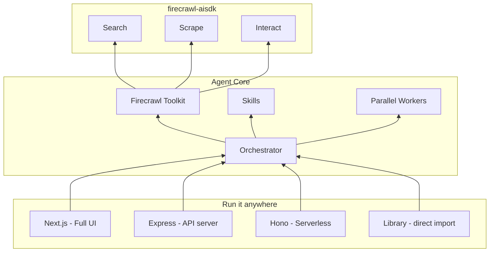

# Firecrawl Agent

AI-powered web research agent. Give it a prompt - it searches, scrapes, and extracts structured data from any website.

Built on [Firecrawl](https://firecrawl.dev/) and [firecrawl-aisdk](https://www.npmjs.com/package/firecrawl-aisdk).

## Get started

```bash
firecrawl agent init my-agent
```

```
? Template
❯ Next.js (Full UI)      Complete web app with chat UI, history, settings
  Express (API only)     Lightweight Node.js API server with /v1/run endpoint
  Hono (Serverless)      Fast, lightweight API - ideal for edge and serverless
```

Auto-detects your Firecrawl API key, scaffolds the project, and installs dependencies. Or skip prompts:

```bash
firecrawl agent init my-agent -t next                            # Full UI
firecrawl agent init my-agent -t express --key anthropic=sk-...  # API server with keys
```

> **Note:** `firecrawl agent init` is coming soon to the [Firecrawl CLI](https://www.npmjs.com/package/firecrawl-cli). While this repo is in development, build the CLI locally:
> ```bash
> cd cli && npm install && npm run build && npm link
> firecrawl-agent init my-agent
> ```

## Usage

**As a library** - import directly, no server needed:

```typescript
import { createAgent } from '@firecrawl/agent-core'

const agent = createAgent({
  firecrawlApiKey: process.env.FIRECRAWL_API_KEY!,
  model: { provider: 'google', model: 'gemini-3-flash-preview' },
})

const result = await agent.run({ prompt: 'Compare pricing for Vercel vs Netlify' })
```

**As an API** - deploy any template, call `POST /v1/run` from any language. See the [API spec](./agent-core/openapi.yaml).

## Templates

| Template | Install | What you get |
|----------|---------|-------------|
| [**Next.js**](./agent-templates/next/) | `firecrawl-agent init my-agent -t next` | Full web app - chat UI, history, settings, streaming |
| [**Express**](./agent-templates/express/) | `firecrawl-agent init my-agent -t express` | Lightweight API server with `POST /v1/run` |
| [**Hono**](./agent-templates/hono/) | `firecrawl-agent init my-agent -t hono` | Fast serverless API with SSE streaming |

All templates share the same [agent core](./agent-core/) and expose the same API.

## Project structure

| Directory | What's inside |
|-----------|--------------|
| [`agent-core/`](./agent-core/) | Core agent logic, orchestrator, skills, tools, [OpenAPI spec](./agent-core/openapi.yaml) |
| [`agent-templates/`](./agent-templates/) | Server templates - [Next.js](./agent-templates/next/), [Express](./agent-templates/express/), [Hono](./agent-templates/hono/) |
| [`agent-sdks/`](./agent-sdks/) | Auto-generated clients for 17 languages |
| [`agent-examples/`](./agent-examples/) | Working examples for every SDK language |
| [`cli/`](./cli/) | CLI tool - `init`, `dev`, `deploy` |

## Architecture



## License

MIT
