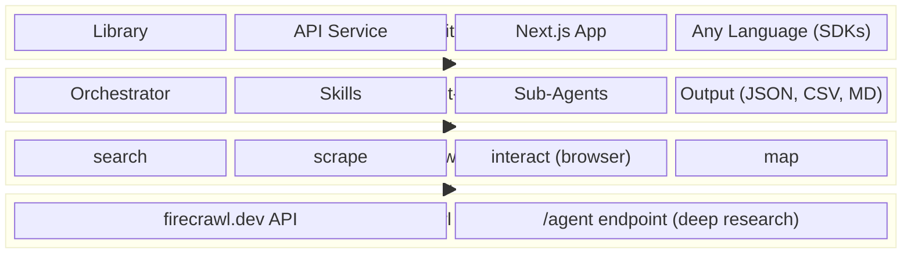

# Firecrawl Agent


AI-powered web research agent built on the [Firecrawl AI SDK](https://www.npmjs.com/package/firecrawl-aisdk) toolkit. Give it a prompt - it searches, scrapes, and extracts structured data from any website.

Use it as a [library](./agent-core/), deploy it as an [API service](./agent-templates/), call it from [any language](./agent-sdks/), or scaffold a full-stack app with the [CLI](#get-started). MIT licensed.

## Get started

```bash
firecrawl-agent init my-agent
```

```
? Template
❯ Next.js (Full UI)      Complete web app with chat UI, history, settings
  Express (API only)     Lightweight Node.js API server with /v1/run endpoint
  Hono (Serverless)      Fast, lightweight API - ideal for edge and serverless
```

Auto-detects your Firecrawl API key, scaffolds the project, and installs dependencies. Or skip prompts:

```bash
firecrawl-agent init my-agent -t next
```

> **Install the CLI:**
> ```bash
> cd .internal/cli && npm install && npm run build && npm link
> ```

## Usage

**As a library** - import directly, no server needed:

```typescript
import { createAgent } from '@firecrawl/agent-core'

const agent = createAgent({
  firecrawlApiKey: process.env.FIRECRAWL_API_KEY!,
  model: { provider: 'google', model: 'gemini-3-flash-preview' },
})

const result = await agent.run({ prompt: 'Compare pricing for Vercel vs Netlify' })
```

**As an API** - deploy any template, call `POST /v1/run` from any language. See the [API spec](./agent-core/openapi.yaml).

## Templates

| Template | Install | What you get |
|----------|---------|-------------|
| [**Next.js**](./agent-templates/next/) | `firecrawl-agent init my-agent -t next` | Full web app - chat UI, history, settings, streaming |
| [**Express**](./agent-templates/express/) | `firecrawl-agent init my-agent -t express` | Lightweight API server with `POST /v1/run` |
| [**Hono**](./agent-templates/hono/) | `firecrawl-agent init my-agent -t hono` | Fast serverless API with SSE streaming |

All templates share the same [agent core](./agent-core/) and expose the same API.

## Project structure

| Directory | What's inside |
|-----------|--------------|
| [`agent-core/`](./agent-core/) | Core agent logic, orchestrator, skills, tools, [OpenAPI spec](./agent-core/openapi.yaml) |
| [`agent-templates/`](./agent-templates/) | Server templates - [Next.js](./agent-templates/next/), [Express](./agent-templates/express/), [Hono](./agent-templates/hono/) |
| [`agent-sdks/`](./agent-sdks/) | Auto-generated SDKs from the [OpenAPI spec](./agent-core/openapi.yaml) |
| [`.internal/cli/`](./.internal/cli/) | CLI tool - `init`, `dev`, `deploy` |

## Architecture



**[Firecrawl Platform](https://firecrawl.dev)** — hosted API for web scraping, search, and browser automation. Includes a built-in `/agent` endpoint for deep research tasks.

**[firecrawl-aisdk](https://www.npmjs.com/package/firecrawl-aisdk)** — AI SDK tools that wrap the Firecrawl API. Drop search, scrape, interact, and map into any Vercel AI SDK agent.

**[agent-core](./agent-core/)** — opinionated agent framework on top. Adds an orchestrator, skills system, parallel sub-agents, and structured output. Configurable — enable/disable tools, swap models, add custom skills.

**Use it however you want** — import as a [library](./agent-core/), deploy as an [API service](./agent-templates/express/), run a full [Next.js app](./agent-templates/next/) with chat UI, or call it from any language via the [OpenAPI spec](./agent-core/openapi.yaml).

## License

MIT
