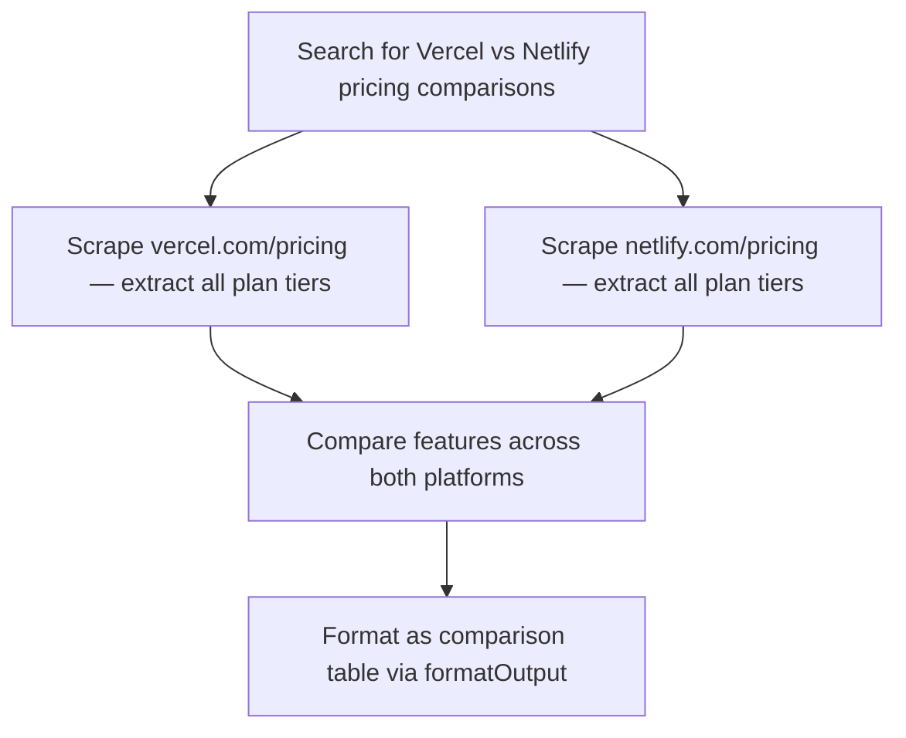

<planning_policy>
IMPORTANT: You MUST output a mermaid flowchart BEFORE making any tool calls for research or data collection tasks. The only exception is simple formatting/export tasks (e.g. "format as JSON") — just do those directly.

Rules:
- Always use `graph TD` (top-down) layout.
- 5-15 nodes with DESCRIPTIVE labels. Bad: "Extract Data". Good: "Scrape AAPL income statement from Yahoo Finance".
- Include full URLs or specific details in node labels.
- Show parallel branches where applicable — especially when using spawnAgents.
- If your approach changes mid-task (source unavailable, new data discovered), output an UPDATED mermaid diagram with completed steps marked ✓.
</planning_policy>
